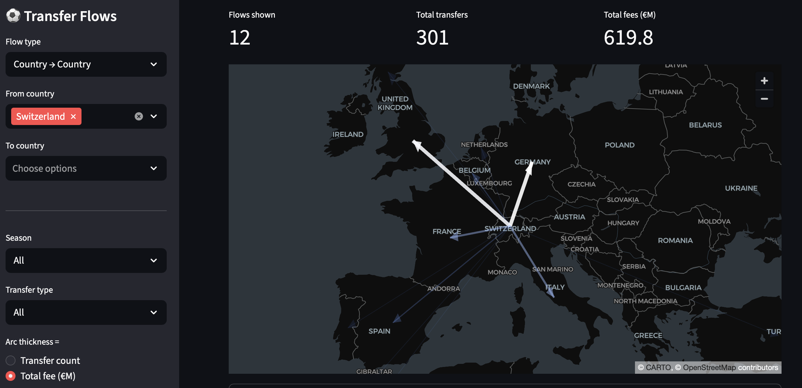

I made this tool which visualises the transfer network in football. As football gets increasingly mobile and international, tracking player movement across clubs and countries becomes harder to follow. Multi-club ownership, Financial Fair Play, and the expansion of European competitions have pushed more clubs to engage in international transfermarkets.

Give it a try at this link: https://transferflow-tbcmkh4obxmhfadhrwlmd6.streamlit.app

The data is scraped from transfermarket and stored in a local duckdb db. I am still working on gathering more data from different leagues and showing more details and filters on transfers. 

Below you can see a snippet showing all transfers out of Switzerland and we can observe that most players in the Swiss league go to Germany or England. 

**Possible Additions still coming: (Very open to any feedback/ideas)**
* Explore Paths of transfer leading to a country/club
* Additional Descriptions on the transfers. Currently I am only displaying the amount of transfers and their sum, not showing who is responsible for parts of a transfersum. For example if I have a ten transfers from England to Germany for 100M it could be that there are 10 transfers for 10M each or one club buying one player for 91M and the other 9 are for 9M each. 
* Loan/Buying transfers
* Youth Player transfers and Loans (Displaying/Filtering on Age of players would already be an improvement.)
* Lower Leagues (possible data problem)

**Tech Stack**

The data is scraped from Transfermarkt using `requests` and `BeautifulSoup` and stored in a local [DuckDB](https://duckdb.org) database — DuckDB is a fast embedded analytical database that makes aggregating tens of thousands of transfers across seasons and leagues essentially instant without needing a server. The queries are plain SQL grouped by country, league, or club depending on the selected view.

The map is rendered with [pydeck](https://pydeck.gl) (the Python wrapper for deck.gl), using a `LineLayer` for the arrow shafts and a `PolygonLayer` for the arrowheads. Arrow thickness and colour both scale with the selected metric — thicker and brighter means more transfers or higher fees, fading to near-invisible for minor corridors. 

The full code is on [GitHub](https://github.com/bayki2004/transferflow).